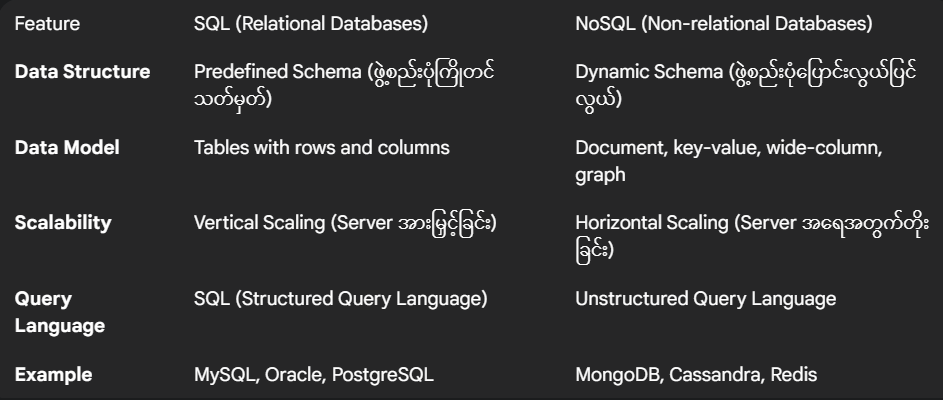

# အခန်း (၁): MongoDB နှင့် NoSQL Databases
## MongoDB ဆိုတာဘာလဲ
MongoDB ဆိုတာ open-source ဖြစ်တဲ့ NoSQL (Not only SQL) database တစ်ခုဖြစ်ပါတယ်။ သူက document-oriented data model ကို အသုံးပြုထားပါတယ်။ ဆိုလိုတာက data တွေကို table ထဲမှာ row နဲ့ column အလိုက် သိမ်းဆည်းတဲ့ relational database (ဥပမာ - MySQL, PostgreSQL) တွေနဲ့မတူဘဲ၊ JSON (JavaScript Object Notation) format နဲ့ ဆင်တူတဲ့ BSON (Binary JSON) format ကိုသုံးပြီး document များအဖြစ် သိမ်းဆည်းပါတယ်။

ဒီ document တွေကို collection ဆိုတဲ့ အစုအဖွဲ့တွေထဲမှာ ထည့်သွင်းပါတယ်။ collection တစ်ခုဟာ relational database မှာရှိတဲ့ table တစ်ခုနဲ့ သဘောတရားချင်း ဆင်တူပါတယ်။

## SQL vs NoSQL: ဘာတွေကွာခြားလဲ?


#### MongoDB ရဲ့ အားသာချက်များ
1. Flexible Schema: Application ရဲ့လိုအပ်ချက်အရ data structure ကို အလွယ်တကူ ပြောင်းလဲနိုင်ပါတယ်။
2. High Performance: Query speed မြန်ဆန်ဖို့အတွက် indexing, sharding (data ခွဲဝေခြင်း) စတဲ့ feature တွေပါဝင်ပါတယ်။
3. High Availability: Replica sets တွေသုံးပြီး data တွေကို copy ပွားထားနိုင်တဲ့အတွက် database server တစ်ခုခု down သွားရင်တောင် system ကဆက်လက်အလုပ်လုပ်နိုင်ပါတယ်။
4. Scalability: Horizontal scaling ကို ကောင်းကောင်း support လုပ်တဲ့အတွက် data ပမာဏကြီးမားလာတာနဲ့အမျှ server တွေတိုးချဲ့ပြီး workload ကို ခွဲဝေနိုင်ပါတယ်။

#### JSON/BSON Data Model အကြောင်း
MongoDB မှာ data တွေကို BSON format နဲ့သိမ်းပါတယ်။ BSON ဆိုတာ JSON format ကို binary-encoded လုပ်ထားတာဖြစ်ပြီး data types တွေပိုစုံလင်သလို၊ data size လည်း ပိုနည်းပြီး data ကို ပိုမြန်မြန် process လုပ်နိုင်ပါတယ်။

ဥပမာ JSON document တစ်ခု:
```json
{
  "name": "Aung Aung",
  "age": 30,
  "email": "aungaung@example.com",
  "courses": ["MongoDB", "Node.js", "React"],
  "address": {
    "street": "Main Street",
    "city": "Yangon"
  }
}
```
ဒီ JSON document ကို MongoDB က BSON အဖြစ်ပြောင်းလဲပြီး collection ထဲမှာ သိမ်းဆည်းပါတယ်။
